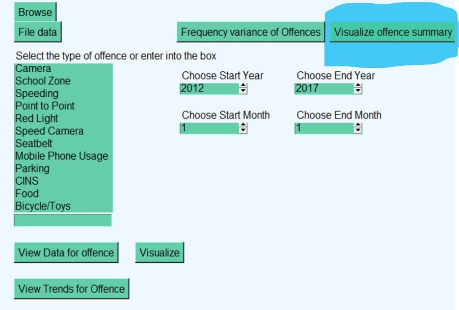
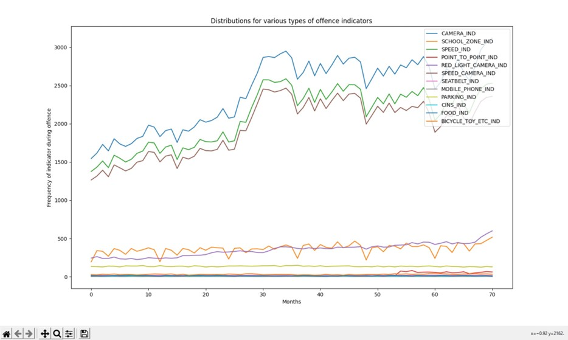
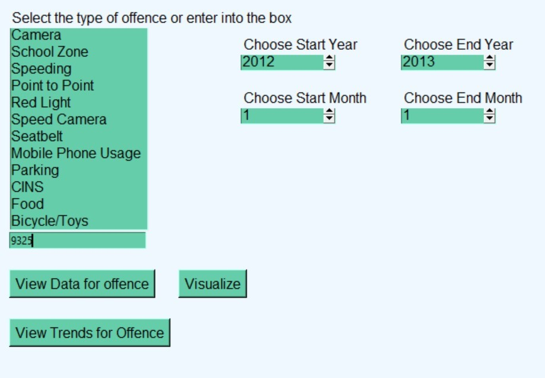
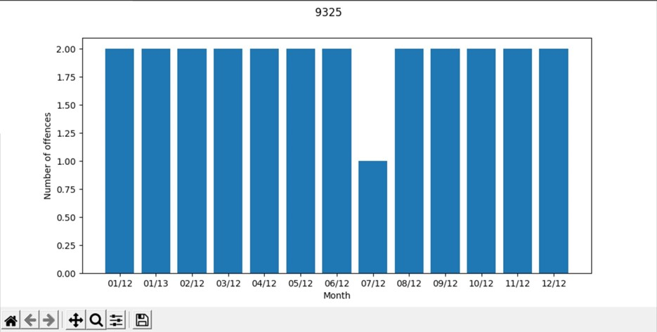
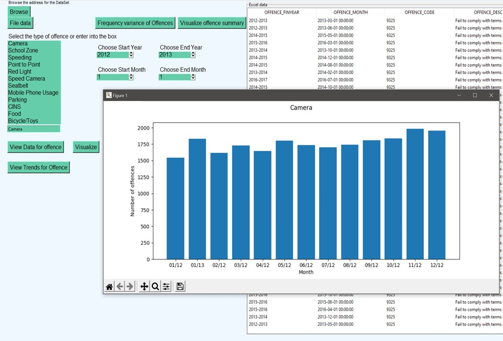
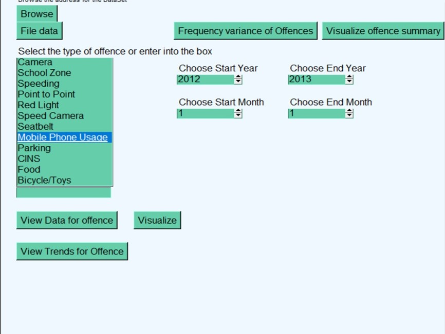
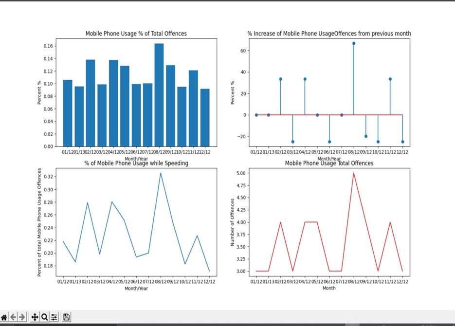
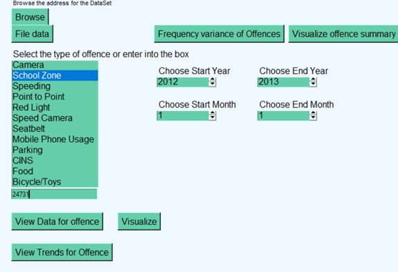
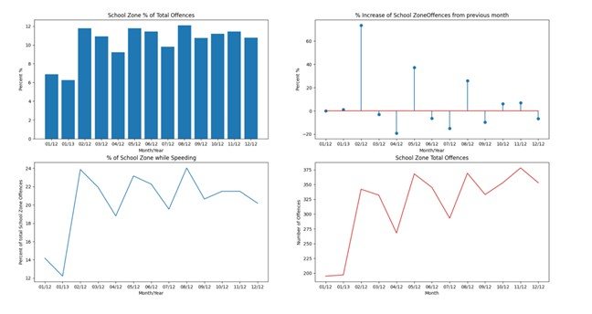

# Data-analytics-application
Built as a project, analysing data from any .csv file to mine and analyse data to display useful data  to the user.

Dataset 

Secondary data has been used for this study which is downloaded from kaggle in the form of  a CSV file. The link for the dataset for the analysis is-  https://www.kaggle.com/llihan/australia-nsw-traffic-penalty-data-20112017. 
If the  link is expired, please use my link from google drive-
https://drive.google.com/drive/folders/1jN3jK9-ftRRIaSBcB_lmDsPL2OYhZ2LT?usp=sharing

EXECUTIVE SUMMARY
Abstract
With the advancement in technology a number of techniques are being developed that can be used for mining data. For that purpose, this study is conducted in which a graphical user interface is designed that helps in generating several useful insights. To obtain the results, tkinter python library has been used that provides the front end functionality in designing the interface for better visualization to discover the significant insights and patterns. There are various functions that are performed to complete the experimental process including data cleaning, extraction and visualizations. An executive summary and a unit testing report has been provided with this assignment which can be used for better understanding. 
Introduction
There are various functionalities that have been implemented that provide features in which options will be provided that assist in choosing the year for designing the visualization. Furthermore, there are various options are given to select the classes of the dataset to perform the analysis. The GUI provides dynamic features in which user can select various features and visualized patterns and discover the important insights to gather the necessary data.  
Analysis 1 (Reporting the information of all penalty cases)

1.1-	This picture displays the working of fulfilling the functionality of reporting all the crimes in a particular time period. The user needs to click the visualize offence summary button to which will display a graph with all the indices in a separate window.

1.2-	The graph is displayed after clicking the button visualize offence summary displaying all the trends in the same graph.
Analysis 2 (Show distribution of cases in each offence code) 

 

2.1- The user can input the time period in the boxes on the top right and then put in the offence code in the search box underneath the tag section. Then the user can view the data for the offence as well as visualize that in a graph by clicking those buttons.

2.2-  This is an example of a graph that shows up in a separate window by putting in an offence code and the information being in a 12 month period.

Analysis 3 (Retrieving cases captured by radar/camera based on offence description)
 

3.1- The user can select the start time and the end time from the time boxes and then either put in the keywords (Camera, Radar or Camera or Mobile) in the search box or even select the same keywords from the tag list above the search box. Then they can view the data for the offence or visualize the data in a graph as depicted in the picture.

Analysis 4 (Mobile phone usage cases analysis)

4.1- The user can get more information on the cases caused by mobile phone usage in detail with the percentage usage of total offences, percentage increase compared to the previous month, percentage of people caught using their phones while speeding and then the total number offences occurred in the time period. These graphs can be created for other data as well such as radar and camera, mobile and camera as well.

 

4.2-  The figure shows 4 graphs with information distributed in a 12 month period. 
Analysis 5 (Viewing trends by offence code or tag)

5.1 The user can manually enter a code into the text box to view the trends for that offence code. The trends analyzed are the same as mobile phone usage: percent of total offences, increase from previous month, percent of cases that occur while speeding and monthly count for the offence. Offence while speeding is of particular interest because it significantly increases the danger of the offence to others.  

5.2 - The trend analyzed with the tool here are school zone infractions. From the graph we can see that January is the lowest month for school zone infractions including speeding in a school zone. This coincides with the scheduling of school holidays. It is possibly caused by lower usage of the roads during those times or less enforcement of road rules during the times school is not in session. There are similar dips in the number of infractions during the other 4 school holidays session, demonstrating a strong correlation. 

